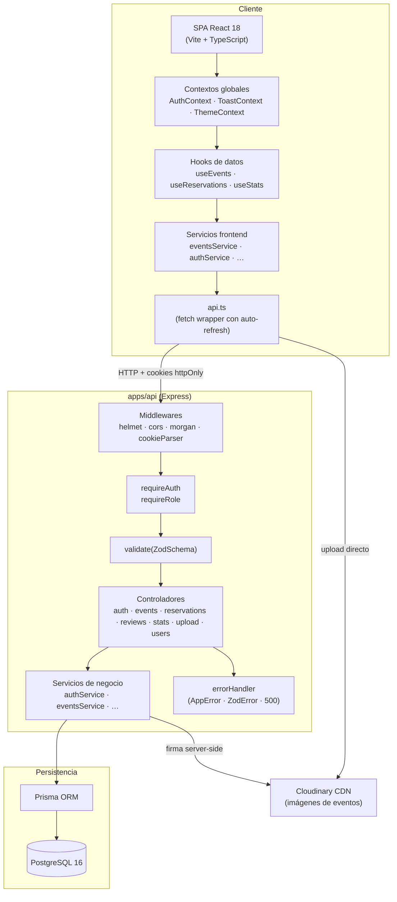
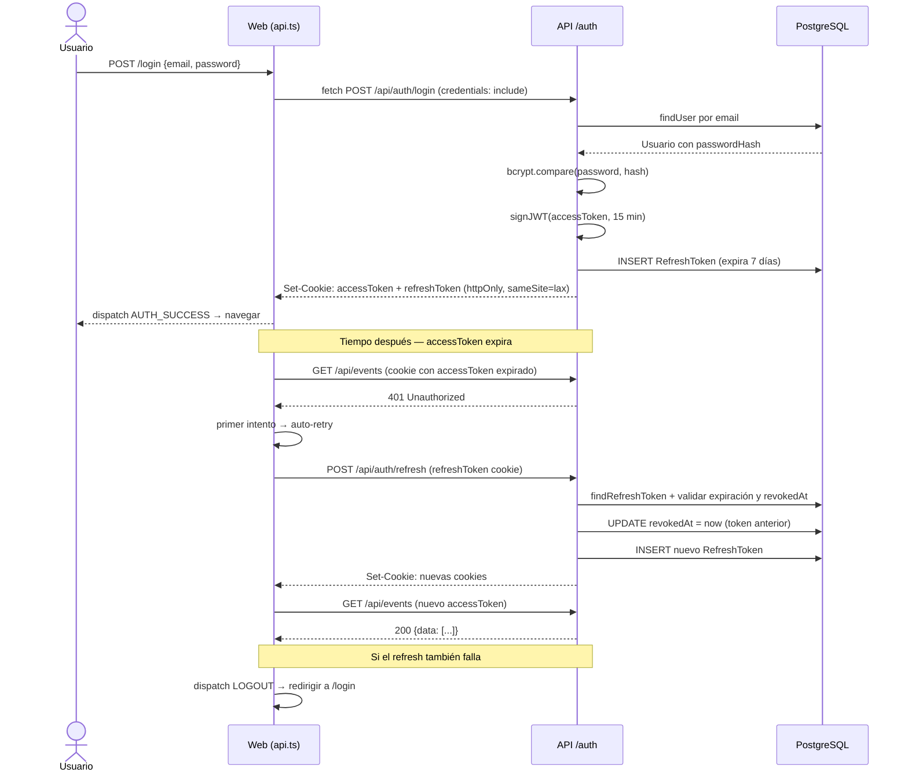
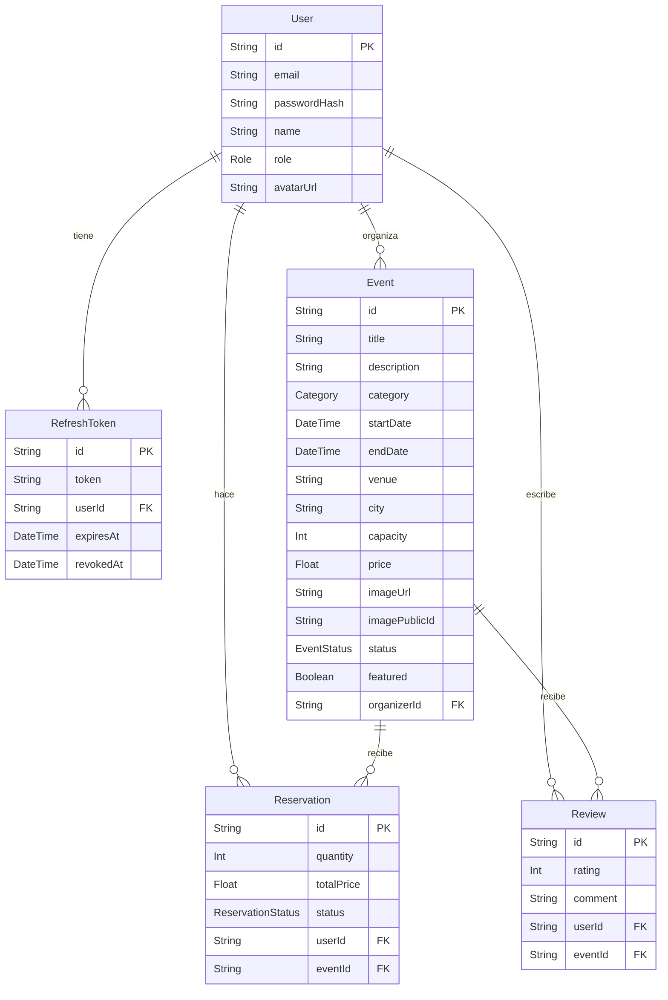

# Arquitectura — Convoca

## Qué es Convoca a nivel técnico

Es un monorepo con pnpm que tiene tres paquetes: la API REST (`apps/api`), el frontend SPA (`apps/web`) y un paquete de tipos compartidos (`packages/shared`). El frontend es completamente estático — no hay SSR ni nada de eso — y habla con el backend solo por HTTP.

La idea de usar monorepo es sencilla: frontend y backend comparten tipos (roles, categorías, estados de eventos, etc.) y sin monorepo tendría que duplicarlos o montar un paquete npm privado, que para un proyecto de este tamaño es pasarse.

---

## Diagrama de capas



Básicamente el flujo va así: el componente React usa un hook → el hook llama a un servicio → el servicio usa `api.ts` (que es un wrapper de fetch) → llega al backend → pasa por los middlewares → llega al controlador → el controlador llama al servicio de negocio → el servicio usa Prisma para hablar con PostgreSQL.

Ningún componente hace `fetch` directamente. Todo pasa por la capa de servicios.

---

## Estructura del monorepo

```
convoca/
├── apps/
│   ├── api/                    # Backend REST
│   │   ├── prisma/
│   │   │   ├── schema.prisma   # Modelos de BD
│   │   │   ├── migrations/     # Historial de migraciones
│   │   │   └── seed.ts         # Datos iniciales
│   │   └── src/
│   │       ├── config/         # env.ts, cloudinary.ts, prisma.ts
│   │       ├── controllers/    # Un fichero por módulo
│   │       ├── middleware/     # requireAuth, requireRole, validate, errorHandler
│   │       ├── routes/         # Un fichero por módulo + index.ts
│   │       ├── services/       # Lógica de negocio separada del HTTP
│   │       └── index.ts        # Punto de entrada
│   └── web/                    # Frontend SPA
│       └── src/
│           ├── components/     # ui/ (shadcn) + common/ + events/ + dashboard/
│           ├── context/        # AuthContext, ToastContext, ThemeContext
│           ├── hooks/          # useFetch, useEvents, useEvent, useReservations…
│           ├── lib/            # utils.ts, formatters.ts
│           ├── pages/          # Por módulo: public/, events/, user/, organizer/, admin/
│           ├── routes/         # AppRouter, ProtectedRoute, RoleRoute
│           ├── services/       # Uno por módulo + api.ts
│           └── types/          # Extensiones locales de @convoca/shared
└── packages/
    └── shared/                 # Tipos TypeScript + enums compartidos
        └── src/types/index.ts
```

---

## Flujo de autenticación

Este es probablemente el flujo más complejo de la app, así que lo explico con un diagrama de secuencia:



Lo importante aquí: cuando el accessToken caduca (15 minutos), el frontend no le pide al usuario que vuelva a loguearse. Lo que hace `api.ts` es interceptar el 401, llamar a `/refresh` por detrás, y reintentar la petición original con el nuevo token. El usuario ni se entera. Si el refresh token también ha caducado (7 días) o está revocado, ahí sí se cierra sesión.

---

## Decisiones técnicas y por qué las tomé

### Cookies httpOnly en vez de localStorage

Los JWT en localStorage se pueden leer desde cualquier script que corra en la página (incluyendo scripts de terceros). Con cookies httpOnly el JavaScript no puede acceder al token. El navegador las manda automáticamente con `credentials: include` y listo.

El coste es que hay que configurar CORS con `credentials: true` y `sameSite: lax`, pero me parece un precio razonable por la seguridad que ganas.

### Context API + useReducer en vez de Redux

El estado global de Convoca se reduce a tres cosas: sesión del usuario, tema visual y toasts. Montar Redux para eso me parecía desproporcionado — mucho boilerplate (actions, reducers, selectors, store, middleware) para un problema que se resuelve con tres contextos de React.

Si en el futuro creciera mucho (más de 5-6 contextos con interacciones entre ellos), migraría a Zustand, que es más ligero que Redux. Pero por ahora Context basta.

### Servicios separados de componentes

Si un componente llama directamente a `fetch`, es muy difícil de testear y la lógica de construir URLs queda repartida por todas partes. Prefiero tener un servicio por módulo (`eventsService`, `reservationsService`...) que encapsule las llamadas. Así los componentes solo llaman a funciones con nombres claros y en los tests mockeo el servicio entero con `vi.mock`.

### Firma server-side para Cloudinary

Cuando un organizador sube un cartel, el frontend NO tiene la API secret de Cloudinary. El flujo es: el frontend pide una firma al backend → el backend firma con el secret → el frontend sube directamente a Cloudinary con esa firma. Así el secret nunca sale del servidor y nadie puede hacer subidas no autorizadas inspeccionando el código del frontend.

### Monorepo con pnpm

La alternativa era tener dos repos separados. El problema con eso es que los tipos (Role, Category, EventStatus, etc.) se comparten entre cliente y servidor. Con monorepo, el paquete `@convoca/shared` se importa directamente y pnpm lo enlaza con un symlink. Si cambio un tipo, TypeScript me avisa en los dos lados a la vez.

---

## Modelo de datos



Las relaciones son bastante directas: un usuario puede organizar eventos (si es ORGANIZER), hacer reservas y escribir reseñas. Un evento tiene reservas y reseñas. La única restricción interesante es que un usuario solo puede dejar una reseña por evento (constraint `@@unique([userId, eventId])` en Prisma) y solo si tiene una reserva con estado ATTENDED.

---

## Stack

| Capa | Tecnología | Versión |
|---|---|---|
| Runtime | Node.js | 20 LTS |
| Framework API | Express | 4.x |
| ORM | Prisma | 5.x |
| Base de datos | PostgreSQL | 16 |
| Validación | Zod | 3.x |
| Auth | jsonwebtoken + bcryptjs | — |
| Imágenes | Cloudinary SDK | 2.x |
| Frontend | Vite + React | 5.x + 18.x |
| Lenguaje | TypeScript | 5.x |
| Estilos | Tailwind CSS + shadcn/ui | 3.x |
| Formularios | react-hook-form | 7.x |
| Gráficos | Recharts | 2.x |
| Iconos | lucide-react | — |
| Testing | Vitest + Supertest + Testing Library | — |
| Paquetes | pnpm workspaces | 9.x |