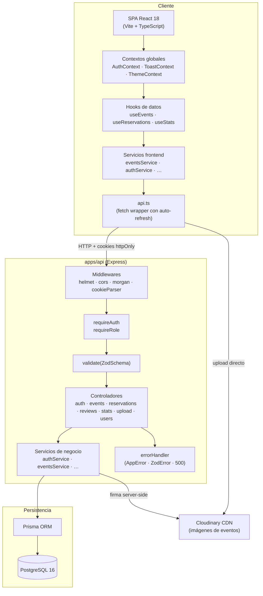
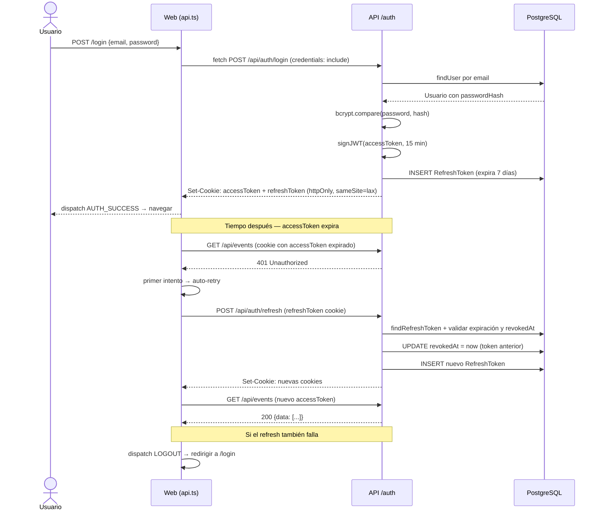
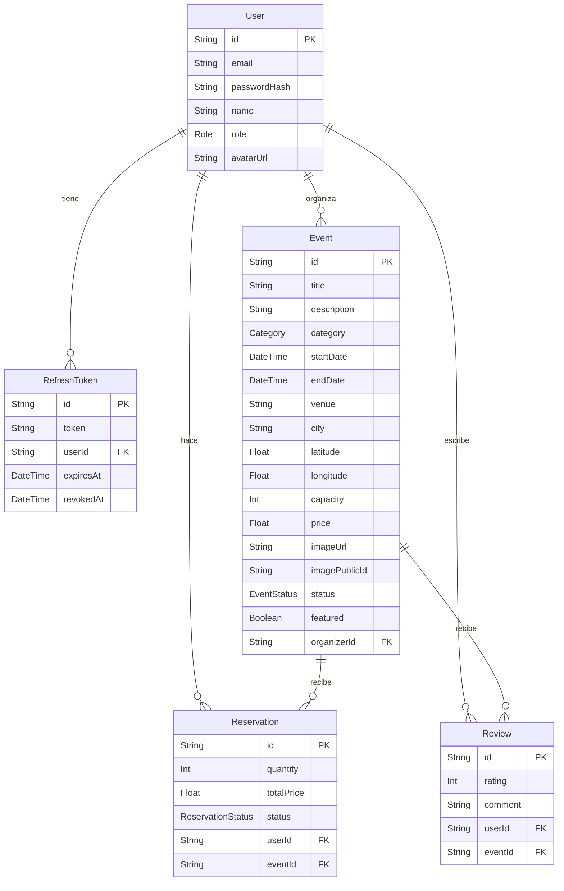

# Arquitectura — Convoca

## Visión general

Convoca es un monorepo pnpm con tres paquetes: una API REST (`apps/api`), una SPA (`apps/web`) y tipos compartidos (`packages/shared`). No hay servidor de renderizado; el frontend es completamente estático y se comunica con el backend exclusivamente mediante HTTP.

---

## Diagrama de capas



---

## Estructura del monorepo

```
convoca/
├── apps/
│   ├── api/                    # Backend REST
│   │   ├── prisma/
│   │   │   ├── schema.prisma   # Modelos de BD
│   │   │   ├── migrations/     # Historial de migraciones
│   │   │   └── seed.ts         # Datos iniciales
│   │   └── src/
│   │       ├── config/         # env.ts, cloudinary.ts, prisma.ts
│   │       ├── controllers/    # Un fichero por módulo
│   │       ├── middleware/     # requireAuth, requireRole, validate, errorHandler
│   │       ├── routes/         # Un fichero por módulo + index.ts
│   │       ├── services/       # Lógica de negocio desacoplada del transporte HTTP
│   │       └── index.ts        # Punto de entrada
│   └── web/                    # Frontend SPA
│       └── src/
│           ├── components/     # ui/ (shadcn) + common/ + events/ + dashboard/
│           ├── context/        # AuthContext, ToastContext, ThemeContext
│           ├── hooks/          # useFetch, useEvents, useEvent, useReservations…
│           ├── lib/            # utils.ts, formatters.ts
│           ├── pages/          # Por módulo: public/, events/, user/, organizer/, admin/
│           ├── routes/         # AppRouter, ProtectedRoute, RoleRoute
│           ├── services/       # Uno por módulo + api.ts
│           └── types/          # Extensiones locales de @convoca/shared
└── packages/
    └── shared/                 # Tipos TypeScript + enums compartidos
        └── src/types/index.ts
```

---

## Flujo de autenticación



**Por qué cookies httpOnly y no localStorage**: las cookies httpOnly son inaccesibles desde JavaScript, lo que elimina el vector de robo de tokens mediante XSS. El backend las gestiona con `Set-Cookie` y el navegador las adjunta automáticamente en cada petición con `credentials: include`. El coste es que hay que gestionar CSRF, mitigado con `sameSite: lax`.

---

## Decisiones arquitectónicas clave

### 1. Monorepo con pnpm workspaces

**Problema**: el frontend y el backend comparten un conjunto de tipos (roles, categorías, estados de entidades, respuestas paginadas). Sin monorepo, habría que duplicarlos o publicar un paquete npm privado.

**Decisión**: monorepo con tres paquetes en `pnpm-workspace.yaml`. El paquete `@convoca/shared` se importa directamente sin publish; pnpm resuelve la dependencia local con un symlink.

**Alternativa descartada**: repositorios separados. Requeriría sincronizar manualmente los tipos o usar contratos OpenAPI, añadiendo fricción sin beneficio real a esta escala.

### 2. Cookies httpOnly en lugar de localStorage para los tokens

**Problema**: los tokens JWT en localStorage son legibles por cualquier script de la página, incluyendo scripts de terceros inyectados.

**Decisión**: `accessToken` y `refreshToken` viajan en cookies httpOnly con `sameSite: lax`. El backend los emite con `Set-Cookie`; el frontend nunca los lee directamente.

**Coste asumido**: CORS requiere `credentials: true` tanto en el servidor como en cada `fetch`. El atributo `sameSite: lax` mitiga CSRF para formularios cross-origin (el caso más común), aunque no protege completamente contra peticiones GET cross-origin con side effects.

### 3. Context API + useReducer en lugar de Redux o Zustand

**Problema**: el estado global se limita a tres dominios independientes: sesión, tema y toasts. Redux añadiría boilerplate (reducers, actions creators, selectors, middleware) desproporcionado al tamaño del problema.

**Decisión**: tres contextos separados con `useReducer`/`useState`. Cada consumidor solo se re-renderiza cuando cambia su contexto específico. Sin dependencias externas de gestión de estado.

**Cuándo reconsiderar**: si el número de contextos crece por encima de cinco con interacciones cruzadas frecuentes, la migración a Zustand es directa porque la API de los hooks (`useAuth`, `useToast`, `useTheme`) no cambia para los consumidores.

### 4. Servicios separados de componentes (frontend)

**Problema**: si los componentes llaman directamente a `fetch`, son imposibles de testear sin mockear el DOM de red, y la lógica de construcción de URLs queda dispersa.

**Decisión**: cada módulo tiene su propio service (`eventsService`, `reservationsService`, etc.) que encapsula las llamadas HTTP. Los componentes y hooks los consumen. En tests, se mockea el módulo de servicio completo con `vi.mock`.

**Resultado**: `EventDetailPage.test.tsx` puede testear el comportamiento de la página sin red real, solo mockeando `eventsService.getById`.

### 5. Firma server-side para subidas a Cloudinary

**Problema**: si el frontend tuviera la `CLOUDINARY_API_SECRET`, cualquiera podría hacer subidas no autorizadas inspeccionando el código o el tráfico de red.

**Decisión**: el frontend nunca ve la API secret. El endpoint `POST /api/upload/sign` (solo para ORGANIZER y ADMIN) genera una firma HMAC con timestamp que Cloudinary valida en la subida. La firma caduca al no tener una ventana de tiempo rígida, pero el timestamp es verificado por Cloudinary.

**Flujo**: frontend solicita firma → backend firma con secret → frontend sube directamente a Cloudinary usando la firma → Cloudinary valida y almacena → frontend guarda la URL pública resultante junto al evento.

---

## Modelos de datos (Prisma)



---

## Stack completo

| Capa                | Tecnología                           | Versión    |
| ------------------- | ------------------------------------ | ---------- |
| Runtime             | Node.js                              | 20 LTS     |
| Framework API       | Express                              | 4.x        |
| ORM                 | Prisma                               | 5.x        |
| Base de datos       | PostgreSQL                           | 16         |
| Validación          | Zod                                  | 3.x        |
| Autenticación       | jsonwebtoken + bcryptjs              | —          |
| Imágenes            | Cloudinary SDK                       | 2.x        |
| Framework web       | Vite + React                         | 5.x + 18.x |
| Lenguaje            | TypeScript                           | 5.x        |
| Estilos             | Tailwind CSS + shadcn/ui             | 3.x        |
| Formularios         | react-hook-form                      | 7.x        |
| Gráficos            | Recharts                             | 2.x        |
| Iconos              | lucide-react                         | —          |
| Testing             | Vitest + Supertest + Testing Library | —          |
| Gestión de paquetes | pnpm workspaces                      | 9.x        |
