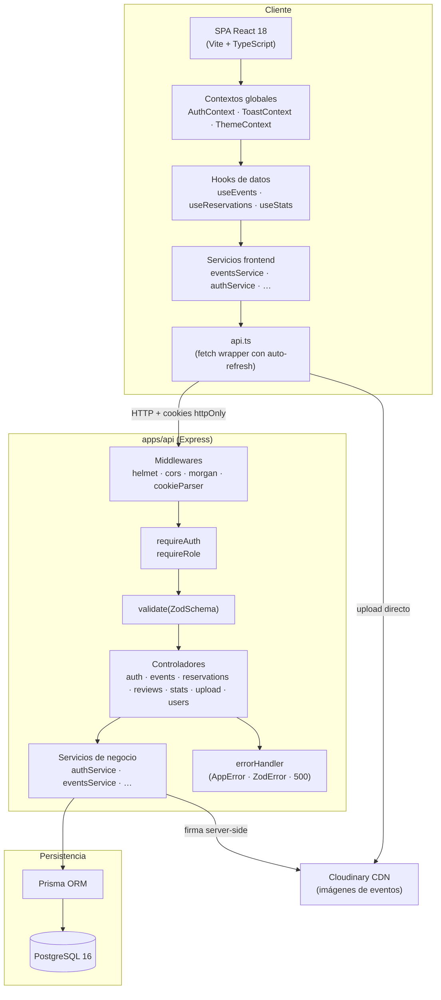
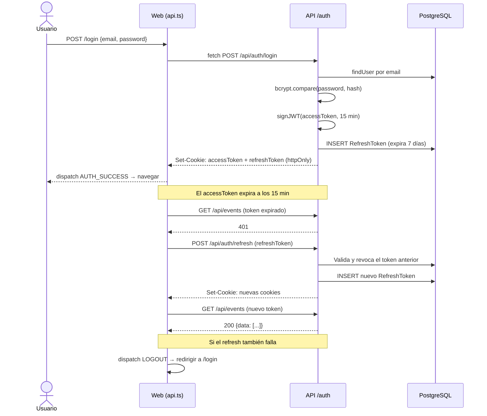
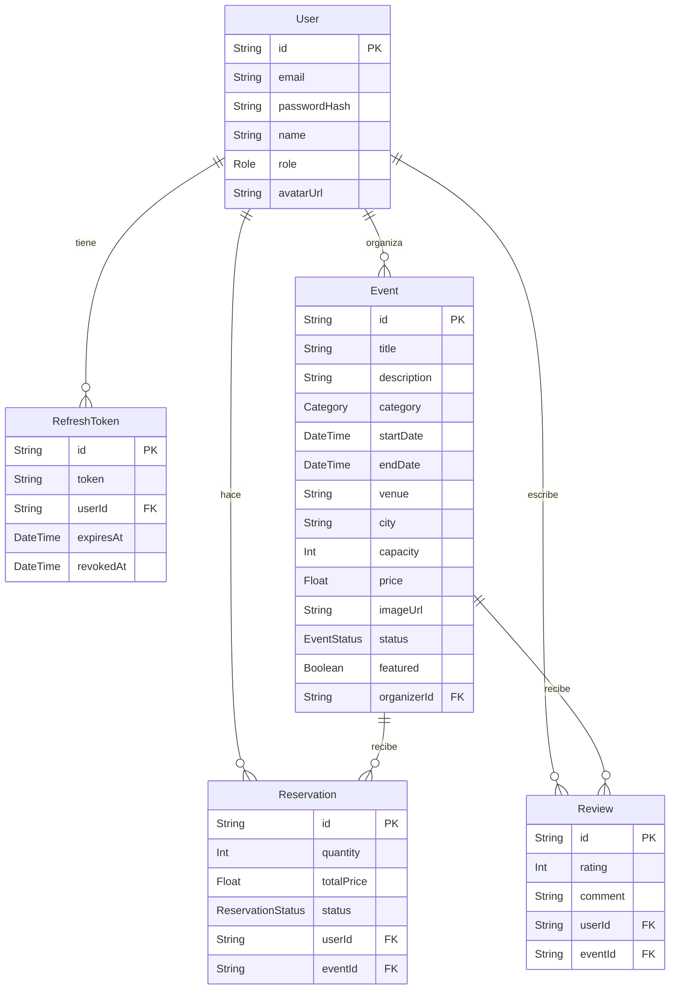

# Arquitectura — Convoca

## Qué es esto

Convoca es un monorepo con pnpm que tiene tres paquetes: la API REST (`apps/api`), el frontend SPA (`apps/web`) y un paquete de tipos compartidos (`packages/shared`). El frontend es estático y solo habla con el backend por HTTP.

Decidí usar monorepo porque frontend y backend necesitan los mismos tipos (roles, categorías, estados de eventos...). Sin monorepo tendría que duplicarlos o montar un paquete npm privado, que para este tamaño de proyecto es demasiado.

---

## Diagrama de capas


```mermaid
graph TB
    subgraph Cliente
        SPA["SPA React 18\n(Vite + TypeScript)"]
        CTX["Contextos globales\nAuthContext · ToastContext · ThemeContext"]
        HOOKS["Hooks de datos\nuseEvents · useReservations · useStats"]
        SVC["Servicios frontend\neventsService · authService · …"]
        API_TS["api.ts\n(fetch wrapper con auto-refresh)"]
    end

    subgraph API ["apps/api (Express)"]
        MIDDLE["Middlewares\nhelmet · cors · morgan · cookieParser"]
        AUTH_MW["requireAuth\nrequireRole"]
        VALIDATE["validate(ZodSchema)"]
        CTRL["Controladores\nauth · events · reservations · reviews · stats · upload · users"]
        SRVC["Servicios de negocio\nauthService · eventsService · …"]
        ERR["errorHandler\n(AppError · ZodError · 500)"]
    end

    subgraph Persistencia
        PRISMA["Prisma ORM"]
        DB[("PostgreSQL 16")]
    end

    CLOUD["Cloudinary CDN\n(imágenes de eventos)"]

    SPA --> CTX
    CTX --> HOOKS
    HOOKS --> SVC
    SVC --> API_TS
    API_TS -->|"HTTP + cookies httpOnly"| MIDDLE
    MIDDLE --> AUTH_MW
    AUTH_MW --> VALIDATE
    VALIDATE --> CTRL
    CTRL --> SRVC
    SRVC --> PRISMA
    PRISMA --> DB
    SRVC -->|"firma server-side"| CLOUD
    API_TS -->|"upload directo"| CLOUD
    CTRL --> ERR
```

El flujo es: el componente React usa un hook → el hook llama a un servicio → el servicio usa `api.ts` → llega al backend → pasa por los middlewares → llega al controlador → el controlador llama al servicio de negocio → Prisma habla con PostgreSQL.

Ningún componente hace `fetch` directamente. Todo pasa por la capa de servicios.

---

## Estructura del monorepo

```
convoca/
├── apps/
│   ├── api/                    # Backend REST
│   │   ├── prisma/
│   │   │   ├── schema.prisma   # Modelos de BD
│   │   │   ├── migrations/     # Historial de migraciones
│   │   │   └── seed.ts         # Datos iniciales
│   │   └── src/
│   │       ├── config/         # env.ts, cloudinary.ts, prisma.ts
│   │       ├── controllers/    # Un fichero por módulo
│   │       ├── middleware/     # requireAuth, requireRole, validate, errorHandler
│   │       ├── routes/         # Un fichero por módulo + index.ts
│   │       └── services/       # Lógica de negocio separada del HTTP
│   └── web/                    # Frontend SPA
│       └── src/
│           ├── components/     # ui/ (shadcn) + common/ + events/ + dashboard/
│           ├── context/        # AuthContext, ToastContext, ThemeContext
│           ├── hooks/          # useFetch, useEvents, useEvent, useReservations…
│           ├── lib/            # utils.ts, formatters.ts
│           ├── pages/          # Por módulo: public/, events/, user/, organizer/, admin/
│           ├── routes/         # AppRouter, ProtectedRoute, RoleRoute
│           └── services/       # Uno por módulo + api.ts
└── packages/
    └── shared/                 # Tipos TypeScript compartidos entre api y web
        └── src/types/index.ts
```

---

## Flujo de autenticación

Es el flujo más complejo de la app. Los tokens van en cookies httpOnly para que JavaScript no pueda leerlos.


```mermaid
sequenceDiagram
    actor U as Usuario
    participant W as Web (api.ts)
    participant A as API /auth
    participant DB as PostgreSQL

    U->>W: POST /login {email, password}
    W->>A: fetch POST /api/auth/login
    A->>DB: findUser por email
    A->>A: bcrypt.compare(password, hash)
    A->>A: signJWT(accessToken, 15 min)
    A->>DB: INSERT RefreshToken (expira 7 días)
    A-->>W: Set-Cookie: accessToken + refreshToken (httpOnly)
    W-->>U: dispatch AUTH_SUCCESS → navegar

    Note over W,A: El accessToken expira a los 15 min

    W->>A: GET /api/events (token expirado)
    A-->>W: 401
    W->>A: POST /api/auth/refresh (refreshToken)
    A->>DB: Valida y revoca el token anterior
    A->>DB: INSERT nuevo RefreshToken
    A-->>W: Set-Cookie: nuevas cookies
    W->>A: GET /api/events (nuevo token)
    A-->>W: 200 {data: [...]}

    Note over W,A: Si el refresh también falla

    W->>W: dispatch LOGOUT → redirigir a /login
```

Cuando el accessToken caduca, `api.ts` intercepta el 401, llama a `/refresh` por detrás y reintenta la petición. El usuario no se entera. Si el refresh también falla, ahí sí se cierra sesión.

---

## Decisiones de diseño

### Cookies httpOnly en vez de localStorage

Los JWT en localStorage los puede leer cualquier script de la página (XSS). Con cookies httpOnly, JavaScript no puede acceder al token. El coste es configurar CORS con `credentials: true` y `sameSite: lax`, pero merece la pena.

### Context API + useReducer en vez de Redux

El estado global son tres cosas: sesión, tema y toasts. Montar Redux para eso es demasiado — mucho boilerplate para un problema que se resuelve con tres contextos.

### Servicios separados de componentes

Si un componente llama directamente a `fetch`, es difícil de testear. Con un servicio por módulo (`eventsService`, `reservationsService`...) los componentes solo llaman a funciones con nombres claros y en los tests se mockea el servicio entero.

### Firma server-side para Cloudinary

El frontend no tiene la API secret de Cloudinary. El flujo es: pide firma al backend → el backend firma con el secret → el frontend sube directamente a Cloudinary. Así el secret nunca sale del servidor.

---

## Modelo de datos


```mermaid
erDiagram
    User {
        String id PK
        String email
        String passwordHash
        String name
        Role role
        String avatarUrl
    }
    RefreshToken {
        String id PK
        String token
        String userId FK
        DateTime expiresAt
        DateTime revokedAt
    }
    Event {
        String id PK
        String title
        String description
        Category category
        DateTime startDate
        DateTime endDate
        String venue
        String city
        Int capacity
        Float price
        String imageUrl
        EventStatus status
        Boolean featured
        String organizerId FK
    }
    Reservation {
        String id PK
        Int quantity
        Float totalPrice
        ReservationStatus status
        String userId FK
        String eventId FK
    }
    Review {
        String id PK
        Int rating
        String comment
        String userId FK
        String eventId FK
    }

    User ||--o{ RefreshToken : "tiene"
    User ||--o{ Event : "organiza"
    User ||--o{ Reservation : "hace"
    User ||--o{ Review : "escribe"
    Event ||--o{ Reservation : "recibe"
    Event ||--o{ Review : "recibe"
```

Un usuario solo puede dejar una reseña por evento (`@@unique([userId, eventId])` en Prisma) y solo si tiene una reserva con estado ATTENDED.

---

## Stack

| Capa | Tecnología |
|---|---|
| Runtime | Node.js 20 LTS |
| Framework API | Express 4 |
| ORM | Prisma 5 |
| Base de datos | PostgreSQL 16 |
| Validación | Zod 3 |
| Auth | jsonwebtoken + bcryptjs |
| Imágenes | Cloudinary SDK 2 |
| Frontend | Vite + React 18 |
| Lenguaje | TypeScript 5 |
| Estilos | Tailwind CSS + shadcn/ui |
| Formularios | react-hook-form |
| Gráficos | Recharts |
| Testing | Vitest + Supertest + Testing Library |
| Paquetes | pnpm workspaces 9 |
