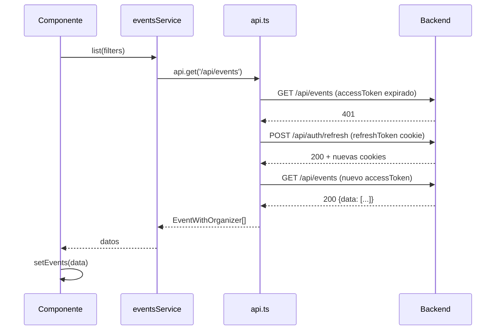

# Manejo de errores — Convoca

El sistema de errores sigue un flujo end-to-end: el backend lanza errores tipados que el middleware transforma en respuestas HTTP estructuradas; el frontend los captura en un único punto y los convierte en notificaciones visuales.

---

## Backend: errores tipados

**Fichero:** `apps/api/src/middleware/errorHandler.ts`

Todas las clases de error extienden `AppError`:

```typescript
class AppError extends Error {
  constructor(public statusCode: number, message: string) {
    super(message);
  }
}

class NotFoundError extends AppError {
  constructor(message = 'Recurso no encontrado') {
    super(404, message);
  }
}

class ForbiddenError extends AppError {
  constructor(message = 'Acceso denegado') {
    super(403, message);
  }
}

class ConflictError extends AppError {
  constructor(message: string) {
    super(409, message);
  }
}
```

Los servicios de negocio lanzan estas clases directamente:

```typescript
// eventsService.ts
if (!event) throw new NotFoundError('Evento no encontrado');
if (event.organizerId !== userId && userRole !== 'ADMIN') throw new ForbiddenError();
if (confirmed > 0) throw new ConflictError('No se puede eliminar un evento con reservas confirmadas');
```

---

## Backend: middleware errorHandler

El middleware es el último en la cadena de Express y captura cualquier error que haya llegado a `next(err)`:

```typescript
function errorHandler(err, req, res, next) {
  // Error tipado de la aplicación
  if (err instanceof AppError) {
    return res.status(err.statusCode).json({ error: err.message });
  }

  // Error de validación Zod
  if (err instanceof ZodError) {
    return res.status(400).json({
      error: 'Datos de entrada no válidos',
      details: err.flatten().fieldErrors,
    });
  }

  // Error no capturado
  console.error(err);
  res.status(500).json({ error: 'Internal server error' });
}
```

**Formato de respuesta de error:**

```json
// AppError (400, 401, 403, 404, 409)
{ "error": "Mensaje legible para el usuario" }

// ZodError (400)
{
  "error": "Datos de entrada no válidos",
  "details": {
    "email": ["Formato de email inválido"],
    "password": ["Mínimo 8 caracteres"]
  }
}

// Error interno (500)
{ "error": "Internal server error" }
```

---

## Middlewares de autorización

### requireAuth

```typescript
// Si no hay cookie accessToken o el JWT no es válido → 401
// Si el JWT está expirado → 401 (el frontend lo intercepta y hace refresh)
// Si el token es válido → inyecta req.user = { id, role }
```

### requireRole

```typescript
// requireRole('ORGANIZER', 'ADMIN') → 403 si req.user.role no está en la lista
```

El orden de middlewares en las rutas protegidas es siempre:
```
requireAuth → requireRole (si aplica) → validate(schema) → controlador
```

---

## Frontend: api.ts (fetch wrapper)

**Fichero:** `apps/web/src/services/api.ts`

El wrapper centraliza toda la comunicación HTTP. Su responsabilidad principal es interceptar 401 y hacer un único intento de refresh antes de propagar el error:

```typescript
async function request<T>(url: string, options: RequestInit): Promise<T> {
  const res = await fetch(url, { ...options, credentials: 'include' });

  if (res.ok) return res.json();

  // Primer 401: intentar refresh automático
  if (res.status === 401 && !options._retry) {
    await fetch('/api/auth/refresh', { method: 'POST', credentials: 'include' });
    // Reintentar la petición original con la nueva cookie
    return request(url, { ...options, _retry: true });
  }

  // Si el refresh también falla o es otro error
  const body = await res.json().catch(() => ({ error: 'Error desconocido' }));
  throw { error: body.error, status: res.status };
}

export const api = {
  get: <T>(url: string) => request<T>(url, { method: 'GET' }),
  post: <T>(url: string, body: unknown) => request<T>(url, { method: 'POST', body: JSON.stringify(body) }),
  put: <T>(url: string, body: unknown) => request<T>(url, { method: 'PUT', body: JSON.stringify(body) }),
  patch: <T>(url: string, body: unknown) => request<T>(url, { method: 'PATCH', body: JSON.stringify(body) }),
  delete: <T>(url: string) => request<T>(url, { method: 'DELETE' }),
};
```

Los errores que lanza `api` tienen siempre la forma `{ error: string, status: number }`. Esto permite discriminarlos de errores JavaScript inesperados mediante un type guard:

```typescript
function isApiError(err: unknown): err is { error: string; status: number } {
  return typeof err === 'object' && err !== null && 'error' in err && 'status' in err;
}
```

---

## Frontend: propagación de errores hasta el usuario

El flujo completo desde un servicio hasta el toast:

```
eventsService.create(data)
  → api.post('/api/events', data)
    → fetch falla (ej. 409 ConflictError)
      → api lanza { error: "No hay capacidad disponible", status: 409 }
        → eventsService relanza el error
          → componente lo captura en try/catch
            → toast.error(err.error) → ToastContext muestra el toast
```

En la práctica, los contextos (`AuthContext`) manejan el error y llaman a `toast.error` internamente, por lo que la mayoría de las páginas solo necesitan:

```typescript
try {
  await login(email, password);
  navigate('/');
} catch {
  // El AuthContext ya ha mostrado el toast de error; solo necesitamos no navegar
}
```

---

## Flujo completo: ejemplo con 401 auto-refresh



Si el refresh devuelve también un 401 (token revocado o expirado), `api.ts` propaga el error. El hook o componente lo captura y, en el caso de `AuthContext`, despacha `LOGOUT` y redirige a `/login`.

---

## Resumen de códigos HTTP y su origen

| Código | Origen en backend | Qué significa para el usuario |
|---|---|---|
| 400 | `validate(ZodSchema)` falla | Los datos enviados no tienen el formato correcto |
| 401 | `requireAuth` — token ausente, inválido o expirado | La sesión ha caducado → el frontend reintenta con refresh |
| 403 | `requireRole` — rol insuficiente; `ForbiddenError` en servicio | No tiene permisos para esta acción |
| 404 | `NotFoundError` en servicio | El recurso solicitado no existe |
| 409 | `ConflictError` en servicio | Conflicto de datos (email en uso, sin capacidad, etc.) |
| 500 | Error no capturado por los anteriores | Error interno; se registra en consola del servidor |
