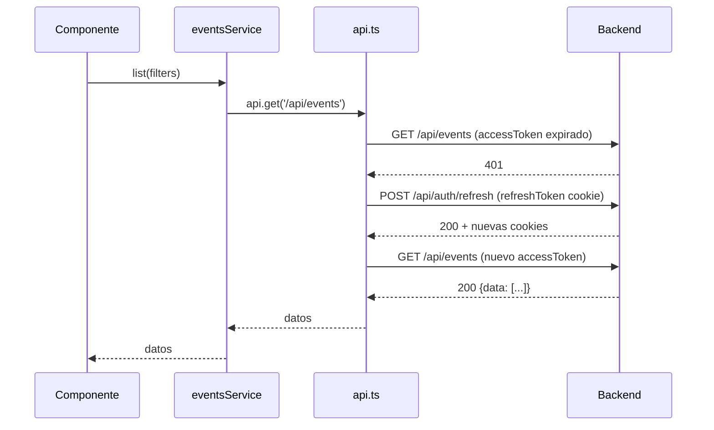

# Manejo de errores — Convoca

## Cómo funciona el sistema de errores de punta a punta

El flujo es: el backend lanza un error tipado → el middleware `errorHandler` lo convierte en una respuesta HTTP con el código adecuado → el frontend lo captura en `api.ts` → el componente o contexto muestra un toast al usuario.

---

## Backend: errores tipados

En vez de hacer `res.status(404).json(...)` en cada controlador, tengo clases de error que extienden de una base `AppError`:

```typescript
class AppError extends Error {
  constructor(public statusCode: number, message: string) {
    super(message);
  }
}

class NotFoundError extends AppError {
  constructor(message = 'Recurso no encontrado') { super(404, message); }
}

class ForbiddenError extends AppError {
  constructor(message = 'Acceso denegado') { super(403, message); }
}

class ConflictError extends AppError {
  constructor(message: string) { super(409, message); }
}
```

Los servicios simplemente lanzan estas clases cuando algo va mal:

```typescript
// En eventsService.ts
if (!event) throw new NotFoundError('Evento no encontrado');
if (event.organizerId !== userId && userRole !== 'ADMIN') throw new ForbiddenError();
```

Así los controladores no se llenan de lógica de errores — solo llaman al servicio y el error burbujea hasta el middleware.

---

## El middleware errorHandler

Es el último middleware de Express. Captura todo lo que llega a `next(err)`:

- Si es un `AppError` → devuelve su statusCode y mensaje
- Si es un `ZodError` (validación de datos) → devuelve 400 con los campos que fallaron
- Si es cualquier otra cosa → devuelve 500 y lo loguea en consola

El formato de respuesta siempre es:

```json
// Error normal (401, 403, 404, 409)
{ "error": "Mensaje para el usuario" }

// Error de validación (400)
{ "error": "Datos de entrada no válidos", "details": { "email": ["Formato inválido"] } }

// Error interno (500)
{ "error": "Internal server error" }
```

---

## Middlewares de auth

El orden en las rutas protegidas siempre es: `requireAuth → requireRole → validate → controlador`.

**requireAuth** lee la cookie `accessToken`, verifica el JWT y mete `req.user = { id, role }`. Si no hay cookie o el JWT está mal → 401.

**requireRole** comprueba que `req.user.role` esté en la lista de roles permitidos. Si no → 403.

---

## Frontend: cómo api.ts gestiona los errores

Todo el manejo de errores HTTP del frontend pasa por `api.ts`. Es un wrapper de fetch que hace dos cosas importantes:

1. **Auto-refresh en 401**: si una petición falla con 401, antes de rendirse intenta llamar a `/refresh` para renovar el token. Si funciona, reintenta la petición original. El usuario ni se entera. Si el refresh también falla, ahí sí propaga el error.

2. **Errores tipados**: cuando algo falla, `api.ts` lanza un objeto `{ error: string, status: number }` en vez de un Error genérico. Así el código que lo consume puede diferenciar un 403 de un 500.

---

## Cómo llega el error hasta el usuario

El camino completo:

```
eventsService.create(data)
  → api.post('/api/events', data)
    → fetch falla con 409
      → api.ts lanza { error: "No hay capacidad", status: 409 }
        → el componente lo captura en try/catch
          → toast.error("No hay capacidad")
```

En la práctica, muchos errores los gestiona `AuthContext` directamente. Por ejemplo, si falla el login:

```typescript
try {
  await login(email, password);
  navigate('/');
} catch {
  // AuthContext ya ha mostrado el toast de error por dentro
  // Aquí solo necesito no navegar
}
```

---

## Diagrama del flujo de auto-refresh



Si el refresh también devuelve 401 (token revocado o expirado), el error se propaga y `AuthContext` despacha LOGOUT y redirige a `/login`.

---

## Resumen de códigos y de dónde vienen

| Código | Quién lo lanza | Qué significa para el usuario |
|---|---|---|
| 400 | `validate(ZodSchema)` | Los datos que mandaste están mal |
| 401 | `requireAuth` | Tu sesión ha caducado (el frontend intenta renovarla antes de molestarte) |
| 403 | `requireRole` o `ForbiddenError` | No tienes permisos para esto |
| 404 | `NotFoundError` | Eso que buscas no existe |
| 409 | `ConflictError` | Conflicto: email en uso, sin capacidad, reseña duplicada... |
| 500 | Error no capturado | Algo ha ido mal por dentro, se loguea en servidor |