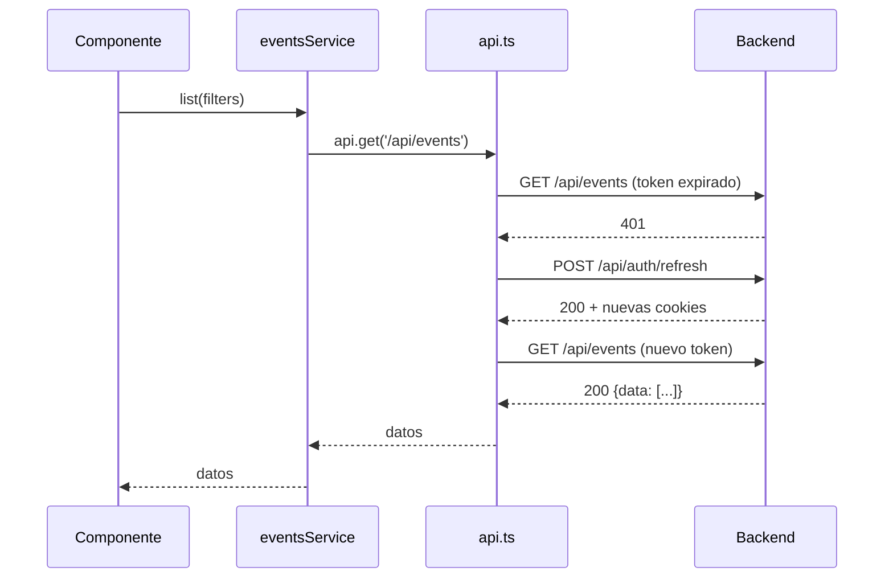

# Manejo de errores — Convoca

## Cómo funciona

El backend lanza un error tipado → el middleware `errorHandler` lo convierte en una respuesta HTTP → el frontend lo captura en `api.ts` → se muestra un toast al usuario.

---

## Backend: clases de error

En vez de hacer `res.status(404).json(...)` en cada controlador, hay clases de error que extienden de `AppError`:

```typescript
class AppError extends Error {
  constructor(public statusCode: number, message: string) {
    super(message);
  }
}

class NotFoundError extends AppError {
  constructor(message = 'Recurso no encontrado') { super(404, message); }
}

class ForbiddenError extends AppError {
  constructor(message = 'Acceso denegado') { super(403, message); }
}

class ConflictError extends AppError {
  constructor(message: string) { super(409, message); }
}
```

Los servicios simplemente lanzan estas clases:

```typescript
if (!event) throw new NotFoundError('Evento no encontrado');
if (event.organizerId !== userId) throw new ForbiddenError();
```

---

## El middleware errorHandler

Es el último middleware de Express. Captura todo lo que llega a `next(err)`:

- Si es un `AppError` → devuelve su statusCode y mensaje
- Si es un `ZodError` → devuelve 400 con los campos que fallaron
- Si es cualquier otra cosa → devuelve 500

Formato de respuesta siempre igual:

```json
{ "error": "Mensaje para el usuario" }

// Error de validación (400)
{ "error": "Datos de entrada no válidos", "details": { "email": ["Formato inválido"] } }
```

---

## Middlewares de auth

El orden en las rutas protegidas siempre es: `requireAuth → requireRole → validate → controlador`.

**requireAuth**: lee la cookie `accessToken`, verifica el JWT y pone `req.user = { id, role }`. Si no hay cookie o el JWT está mal → 401.

**requireRole**: comprueba que `req.user.role` esté en la lista de roles permitidos → 403 si no.

---

## Frontend: cómo api.ts gestiona los errores

Todo el manejo de errores HTTP pasa por `api.ts`. Hace dos cosas importantes:

1. **Auto-refresh en 401**: si una petición falla con 401, intenta llamar a `/refresh` para renovar el token y reintenta la petición. El usuario no se entera. Si el refresh también falla, propaga el error.

2. **Errores tipados**: lanza `{ error: string, status: number }` en vez de un Error genérico, para que el código que lo consume pueda diferenciar un 403 de un 500.

---

## Flujo del auto-refresh


```mermaid
sequenceDiagram
    participant C as Componente
    participant SVC as eventsService
    participant API as api.ts
    participant BE as Backend

    C->>SVC: list(filters)
    SVC->>API: api.get('/api/events')
    API->>BE: GET /api/events (token expirado)
    BE-->>API: 401
    API->>BE: POST /api/auth/refresh
    BE-->>API: 200 + nuevas cookies
    API->>BE: GET /api/events (nuevo token)
    BE-->>API: 200 {data: [...]}
    API-->>SVC: datos
    SVC-->>C: datos
```

Si el refresh también devuelve 401, `AuthContext` despacha LOGOUT y redirige a `/login`.

---

## Resumen de códigos

| Código | Quién lo lanza | Qué significa |
|---|---|---|
| 400 | `validate(ZodSchema)` | Los datos están mal formados |
| 401 | `requireAuth` | Sesión caducada (el frontend intenta renovarla antes) |
| 403 | `requireRole` o `ForbiddenError` | No tienes permisos |
| 404 | `NotFoundError` | El recurso no existe |
| 409 | `ConflictError` | Email en uso, sin capacidad, reseña duplicada... |
| 500 | Error no capturado | Algo ha ido mal, se loguea en servidor |
